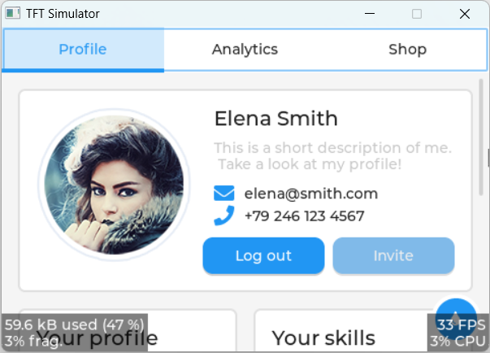

# lv_port_pc

> LVGL (v8.3) Demo.

## 1 Download

> [winlibs-x86_64-posix-seh-gcc-13.2.0-llvm-17.0.6-mingw-w64ucrt-11.0.1-r5.zip](https://winlibs.com) 
> [SDL2-devel-2.30.2-mingw.zip](https://github.com/libsdl-org/SDL/releases/tag/release-2.30.2)  
> [lv_port_pc_eclipse-release-v8.3.zip](https://github.com/lvgl/lv_port_pc_eclipse/tree/release/v8.3)  
> [lv_drivers-release-v8.3.zip](https://github.com/lvgl/lv_drivers/tree/release/v8.3)  
> [lvgl-release-v8.3.zip](https://github.com/lvgl/lvgl/tree/release/v8.3)

## 2 Install

1. Unzip `winlibs-x86_64-posix-seh-gcc-13.2.0-llvm-17.0.6-mingw-w64ucrt-11.0.1-r5.zip` to `mingw64`.
2. Unzip and copy `x86_64-w64-mingw32` of `SDL2-devel-2.30.2-mingw.zip` to `mingw64`.
3. Unzip `lv_port_pc_eclipse-release-v8.3.zip` and rename to `lv_port_pc`.
4. Unzip and copy `lv_drivers` of `lv_drivers-release-v8.3.zip` to `lv_port_pc`.
5. Unzip and copy `lvgl` of `lvgl-release-v8.3.zip` to `lv_port_pc`.

## 3 Toolchains

## 4 Demo

